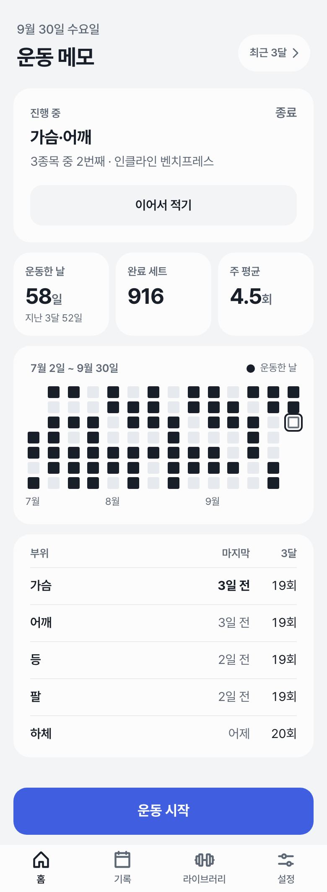
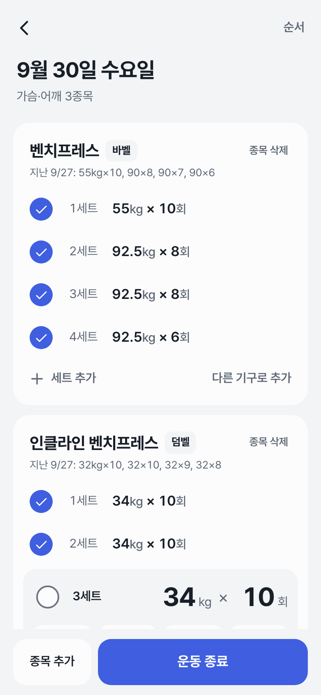
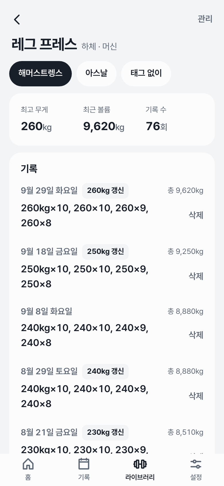
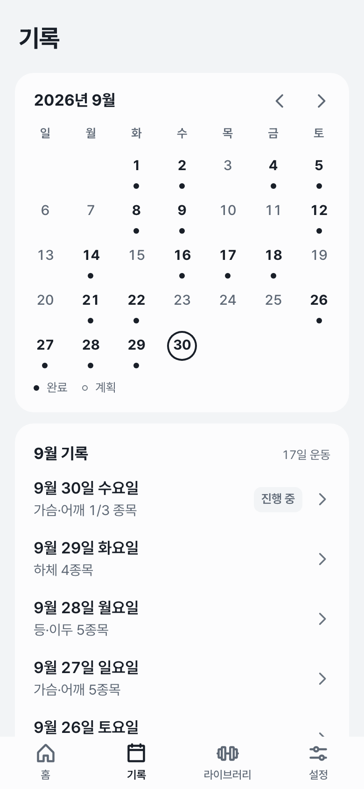
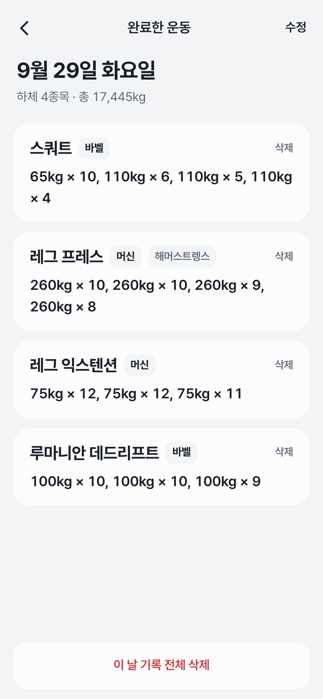
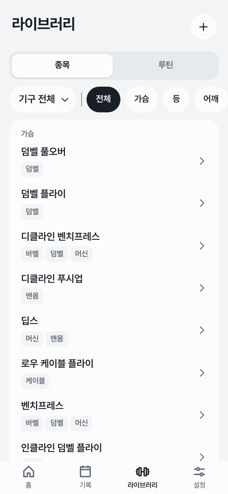

# 웨이로그 (Weylog)

**같은 종목이라도 기구가 다르면 기록을 따로 쌓는 헬스 운동 기록 앱.**

헬스장마다 머신 브랜드가 달라서 "레그 프레스 200kg"이 어느 머신 기준인지 헷갈리는 문제를 풀려고 만들었습니다.
기록 단위를 *종목*이 아니라 *종목 × 기구 태그*로 잡아서, 세트를 적을 때 **그 기구로 했던 직전 기록**이 바로 보입니다.

- 1인 기획·디자인·개발·운영 (2026.08 ~ 진행 중), 직접 매일 쓰면서 개선 중
- 서비스: https://weylog.vercel.app (가입 후 이용 — 이 저장소는 화면 소개용이고, 소스 저장소는 비공개입니다)

> 아래 화면은 로컬 환경에 샘플 데이터를 넣어 캡처했습니다.

---

## 주요 화면

<table>
  <tr>
    <td width="45%" align="center"></td>
    <td valign="middle">
      <h3>홈 대시보드</h3>
      <ul>
        <li><b>진행 중인 운동</b> — 몇 번째 종목까지 했는지 보여주고 바로 이어 적기</li>
        <li><b>요약 숫자</b> — 운동한 날 · 완료 세트 · 주 평균, 지난 기간과 비교</li>
        <li><b>운동일 격자</b> — 1주 · 2주 · 1달 · 3달 중 고른 기간을 한 장에</li>
        <li><b>부위별 마지막 운동일</b> — 가장 오래 쉰 부위가 맨 위로 와서 오늘 뭘 할지 정하기 쉽게</li>
      </ul>
    </td>
  </tr>
</table>

<table>
  <tr>
    <td align="center" width="33%"><br><b>운동 기록</b><br>종목마다 지난 기록 표시 · 세트 체크</td>
    <td align="center" width="33%"><br><b>종목 상세</b><br>같은 레그 프레스도 기구 태그별로 분리</td>
    <td align="center" width="33%"><br><b>기록</b><br>월간 캘린더 · 날짜별 요약</td>
  </tr>
  <tr>
    <td align="center"><br><b>완료한 운동</b><br>종목별 세트 · 총 볼륨</td>
    <td align="center"><br><b>라이브러리</b><br>부위 × 기구 2축 필터 · 루틴</td>
    <td></td>
  </tr>
</table>

---

## 기능

- **기구 태그 단위 기록** — 종목(예: 레그 프레스) 아래에 기구·브랜드 태그(해머스트렝스, 아스날 …)를 두고 기록·직전 기록·최고 무게를 태그별로 집계
- **홈 대시보드** — 기간(1주~3달)별 운동일 격자, 운동한 날·완료 세트·주 평균, 부위별 마지막 운동일
- **세트 기록** — 무게·횟수 입력, 완료 체크, 세트 유형(드롭·슈퍼·실패), 종목 순서 변경, 루틴으로 시작
- **기록 조회** — 월간 캘린더, 날짜별 세션 요약, 종목별 히스토리(최고 무게·최근 볼륨·갱신 표시)
- **종목 라이브러리** — 기본 종목 약 145개 + 사용자 종목, 부위 × 기구 필터, 숨기기
- **한글 검색** — 초성 검색(`ㄹㄱㅍ` → 레그 프레스), 띄어쓰기 무시, 입력 중인 글자(`렉` → 레그)까지 매칭
- **PWA** — 홈 화면 설치, 라이트·다크 테마

## 기술 스택

| 영역 | 사용 |
|---|---|
| 프론트엔드 | Next.js 16 (App Router, Server Components), React 19, TypeScript, Tailwind CSS 4 |
| 백엔드 | Next.js Server Actions, Supabase (Postgres · Auth), Zod |
| 테스트 | Vitest (테스트 파일 25개, 케이스 약 260개) |
| 배포·운영 | Vercel (서울 리전), 로컬 Docker Supabase → 운영 DB 마이그레이션 흐름 |

## 설계에서 신경 쓴 부분

**1. 데이터 접근은 서버에서만, 권한은 DB에서 한 번 더**
비즈니스 로직은 전부 Server Actions에 두고, 모든 테이블에 Postgres RLS(Row Level Security)를 걸어 사용자는 자기 행만 읽고 쓸 수 있습니다.
앱 코드에 실수가 있어도 다른 사람의 기록이 새지 않도록 권한 검사를 DB 층에 한 번 더 둔 구조입니다.

**2. 기록 모델: 종목 → 기구 변형(variant) → 세션 종목 → 세트**
"직전 기록"은 종목이 아니라 variant 기준으로 조회합니다. 한 화면에 여러 종목이 있어도 variant ID를 모아 **한 번의 쿼리**로 가져와 N+1 조회를 피했습니다.

**3. 헬스장 네트워크에서도 입력이 사라지지 않게**
세트 입력은 기기의 저장 대기열(localStorage)에 먼저 쌓고, 서버 저장에 성공한 항목만 지웁니다. 지하 헬스장처럼 연결이 불안정해 저장이 실패해도 입력은 기기에 남아 있다가, 기록 화면에 다시 들어오면 재전송됩니다.

**4. 로그인 풀림 버그 — 에러를 "미로그인"과 "일시 장애"로 나누기**
실사용 중 로그인이 자주 풀리는 문제가 있었습니다. 원인은 인증 서버 호출이 네트워크 때문에 실패한 경우까지 미로그인으로 처리해 로그인 화면으로 보내던 것이었습니다.
Supabase Auth 에러를 재시도 가능한 장애(네트워크·5xx)와 세션 거부(만료·폐기된 토큰)로 나누는 판정 함수를 만들고 테스트로 고정했습니다.

**5. 디자인 토큰을 테스트로 강제**
화면이 늘면서 글자 크기 15단계, 모서리 둥글기 14종으로 값이 흩어진 적이 있어, 토큰 세트(타이포 7 · 라운드 6 · 색 역할 토큰)로 모았습니다.
그 뒤로는 className에 hex 색이나 임의값을 쓰면 실패하는 **스타일 가드 테스트**를 두어 다시 흩어지지 않게 했습니다.

**6. 운영 절차**
로컬 Docker DB에서 마이그레이션·화면 검증 → 운영 DB 백업 → 마이그레이션 적용 → `main` 머지(자동 배포) 순서로 배포합니다.
`develop` 브랜치는 프리뷰 환경으로 실기기에서 먼저 확인합니다.

**7. AI 에이전트와 함께 개발하는 방식**
기능마다 스펙 → 구현 계획 → 태스크 단위 구현 순서로 진행하고, 태스크마다 Claude Code 하위 에이전트(구현 · 스펙/품질 리뷰 · 재리뷰)를 나눠 돌려 리뷰를 거친 뒤 합칩니다.

---

## 데이터 모델 (요약)

```
exercises ─┬─ exercise_variants (사용자 × 기구 × 태그) ─┬─ session_exercises ── set_records
           │                                           └─ routine_items ── routines
           └─ (기본 종목 · 사용자 종목)
workout_sessions ── session_exercises
profiles (닉네임 · 단위 · 테마)
```
